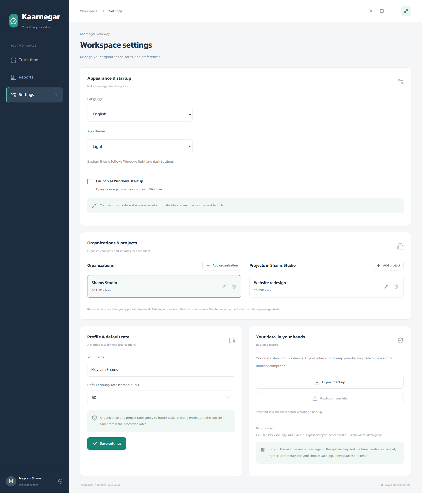

<p align="center">
  
</p>

<h1 align="center">Kaarnegar</h1>
<p align="center">Make your time count.</p>
<p align="center">An offline Windows and Linux time tracker for organizations and projects, with Persian and English interfaces, local reports, and multiple currencies.</p>
<p align="center"><a href="../../releases">Download for Windows or Linux</a> &middot; <a href="#getting-started">Getting started</a> &middot; <a href="#development">Development</a></p>


Kaarnegar keeps everyday time tracking simple: name your task, start the timer, and turn your saved work into a clear report. Everything stays on your computer. No account, server, or internet connection is required to use the app.

## Features

| Feature | What you can do |
| --- | --- |
| Time tracking | Start, pause, resume, and save a task; edit start/end times, including a running timer's start. |
| Task suggestions | Type a title or choose a matching previous task with its organization and project. |
| Manual entries | Choose start/end dates and times; duration and earnings are calculated automatically. |
| Organizations & projects | Define organizations, add optional projects, and assign every task to an organization. |
| Rates & currencies | Set organization rates and optional project overrides. Track IRT, IRR, USD, EUR, GBP, CAD, AUD, AED, CHF, JPY, and TRY. Each task keeps its recorded rate and currency. |
| Languages | Switch between Persian (RTL, Jalali calendar) and English (LTR, Gregorian calendar). The interface, tray, and PDF reports follow your language. |
| Compact widget | Keep a small, always-on-top timer nearby. Your last window mode and size return on the next launch. |
| Themes | Choose Light, Dark, or System. Dark mode uses charcoal surfaces and soft teal accents; System follows your desktop automatically. |
| Windows startup | Enable the startup checkbox in Settings to open Kaarnegar when you sign in to Windows. |
| System tray | Close the window while your timer keeps running. Reopen or quit from the tray menu. |
| Reports | Filter by date, organization, and project. Search tasks, compare tracked time, and see separate totals for each currency. |
| PDF export | Export the filtered report in Persian or English, with embedded Arad fonts and selectable text. |
| Backup and restore | Export your work history to JSON and restore it on another computer. |

English is the default language. The application also supports Persian. Change the language in Settings; your selection is saved for the next launch.

<details>
<summary>English workspace and profile settings</summary>



</details>

## Getting started

Download an x64 build from [Releases](../../releases):

- **Installer:** `Kaarnegar-Setup-<version>.exe` lets you choose an installation folder and creates desktop and Start menu shortcuts. The installer supports English and Persian.
- **Windows portable:** `Kaarnegar-<version>.exe` runs without installation. Keep it in a stable location if you enable Windows startup, since Windows launches that executable path.
- **Linux AppImage:** `Kaarnegar-<version>-x86_64.AppImage` runs without installation. Make it executable with `chmod +x Kaarnegar-<version>-x86_64.AppImage`, then open it. The AppImage runtime requires FUSE 2; use the Debian package if your system does not provide it.
- **Linux Debian package:** `Kaarnegar-<version>-amd64.deb` installs on Ubuntu, Debian, and compatible distributions. Install with `sudo apt install ./Kaarnegar-<version>-amd64.deb`.

You do not need Node.js or a separate font installation to run these downloads. Linux tray visibility depends on your desktop's support for application indicators. If the tray is hidden, opening Kaarnegar again restores the running window. Automatic startup from Settings is available on Windows.

1. Open **Settings** and choose your language and theme. Optionally enable **Launch at Windows startup**. These preferences save immediately.
2. Add an **organization**, its hourly rate, and its currency. Add projects when you want to track work separately.
3. On the timer page, type a task title or choose a previous task suggestion to fill in its title, organization, and project. Select the required organization and an optional project, then start tracking.
4. Use **Pause** for a break, or **Stop and save** to add the task to your reports. Click the timer's start time to adjust it. Manual entries also require an organization and calculate duration from start/end dates and times.
5. Open **Reports**, choose a date range and organization/project filters, and export the matching entries to PDF.

Use the widget button in the window header to switch between the full dashboard and compact mode. Kaarnegar remembers both sizes, the window position, and whether the full window was maximized.

### Dark theme and compact mode

Choose **Dark** in Settings for a calmer workspace, or **System** to follow your desktop. The same theme carries through the dashboard, reports, calendar, dialogs, and compact timer.


<p align="center"></p>

### Closing and quitting

Closing the window or pressing Alt+F4 hides Kaarnegar in the system tray. An active timer continues running and saving checkpoints. Click the tray icon or choose **Open app** from its menu to return. Opening Kaarnegar again also restores the running window.

Choose **Quit app** from the tray menu to exit completely. The timer is saved and paused before exit. Putting the computer to sleep also pauses the timer.

### How time and earnings work

- Each organization has a currency. Projects use that currency and can set an hourly rate override; leaving the project rate blank inherits the organization rate. A zero rate is allowed for unpaid work.
- Entries keep their recorded rate and currency, including when organization/project settings change. A manual entry can override the inherited rate.
- Earnings use the exact tracked duration. IRT, IRR, and JPY display whole units; other supported currencies display up to two decimal places. **Reports total each currency separately and never perform currency conversion.**
- The profile default rate is a starting value for new organizations. It does not change existing organization or project rates.
- Timers crossing midnight are split by the computer's local date. Reports include saved entries; stop and save the current task to include it.
- A manual entry can contain up to 24 hours of work. For overnight work, select the following day as its end date; it is reported under its start date.
- Saved entries can be edited using start/end dates and times. Timer pauses remain excluded from duration and earnings. Older entries only stored duration, so their edit form offers a suggested interval to adjust before saving.

## Reports


Reports combine saved task details, organization/project assignments, total time, currency totals, and a chart of time spent per task. Date, search, organization, and project filters also apply to the exported PDF. Filenames use Jalali dates in Persian and Gregorian dates in English. The bundled Arad font is embedded in exported PDFs, so text renders without installing fonts on the recipient's computer.

PDFs use the title **Work summary report** (**گزارش میزان کارکرد** in Persian), with task details, dates, durations, and amounts. Organization/project labels and the brand tagline are omitted.

## Your data

Work history is stored locally in `work-data.json` inside the app's user-data folder, normally `%APPDATA%\kaarnegar`. Settings shows the exact location. The previous version of the work file is retained as `work-data.json.bak` before each write.

On Linux the default data directory is `~/.config/kaarnegar`, or the corresponding directory under `XDG_CONFIG_HOME` when configured.

Organizations and projects are included in work-history backups. Existing history from earlier versions is automatically assigned to a **General** organization, preserving its original rates, durations, and toman currency. Referenced organizations and projects cannot be deleted until their entries are reassigned or removed.

Theme, language, and window preferences are stored separately in `preferences.json`. Windows manages the startup registration. Work-history backups do not transfer these device preferences or startup registration.

The timer saves a checkpoint every 15 seconds. After a power failure or unexpected termination, the last saved checkpoint returns paused. Any time after that checkpoint can be added manually.

Export backups regularly to another location. **Restoring a backup replaces your current work history and profile settings.** Stop and save the timer before restoring. Uninstalling the app retains your work data.

## Development

Use **Windows or Linux** and **Node.js 22 or newer** for development. GitHub Actions packages Windows on a Windows runner and Linux on an Ubuntu runner, using Node.js 24.

```powershell
npm ci
npm run build
npm start
```

| Command | Purpose |
| --- | --- |
| `npm run dev` | Run the Vite browser preview. |
| `npm run build` | Check TypeScript and build the renderer. |
| `npm start` | Open the built app in Electron. |
| `npm test` | Run model, preference, migration, currency, and localization tests. |
| `npm run test:app` | Run the original Electron workflow and the organizations/currencies/English workflow. Build first. |
| `npm run package` | Build the Windows x64 installer and portable executable. |
| `npm run package:portable` | Build only the portable executable. |
| `npm run package:linux` | Build Linux x64 AppImage and Debian packages on Linux. |
| `npm run icons` | Regenerate Windows icon assets using PowerShell. |

If PowerShell blocks `npm.ps1`, use `npm.cmd` in these commands.

The browser preview supports time tracking and themes using local storage. Windows startup, native save/restore dialogs, and always-on-top window behavior require the Electron app.

### Project layout

```text
src/          React interface, timer model, Jalali dates, report templates
electron/    Desktop lifecycle, IPC bridge, tray, local storage, preferences
tests/       Model, preferences, and Electron integration tests
public/      Application icons and bundled Arad fonts
build/       Installer resources
scripts/     Build helpers and icon generation
docs/        Screenshots and release notes
```

The desktop renderer runs with context isolation, sandboxing, and no Node.js access. Native operations are exposed through the preload bridge.

### Testing

```powershell
npm test
npm run build
npm run test:app
```

Integration tests use a temporary data directory and write screenshots and a real PDF to `test-artifacts/`. They keep your personal work history separate. Startup tests stub Windows registration to avoid changing the test machine's actual startup list.

To test an installed or portable executable, set `KAARNEGAR_TEST_EXECUTABLE` to its absolute path before running `npm run test:app`.

### Building a release

Build outputs are written to `release/`. [Build desktop apps](.github/workflows/desktop-build.yml) builds Windows and Linux downloads on GitHub when a `v*` tag is pushed. It can also be started manually from the Actions tab. Tests are optional through the manual build's `run_tests` input; tag builds skip tests.

To publish a release without building on your own computer:

1. Update the version in `package.json` and `package-lock.json`, add release notes, and push the commit and its `v<version>` tag.
2. Wait for both jobs in **Build desktop apps** to succeed and note the workflow run ID from its URL.
3. Create a draft GitHub release for that tag.
4. Run [Publish desktop release](.github/workflows/publish-release.yml) from the Actions tab with the tag and successful build run ID. It verifies the tagged commit, attaches the Windows installer, Windows portable app, Linux AppImage, Debian package, and combined `SHA256SUMS.txt`, then publishes the draft.

The NSIS build helper handles the Persian/Farsi language-name mismatch, and `build/installer.nsh` supplies missing Persian installer strings. Bundled icon assets cover Windows sizes from 16 to 256 pixels.

## License

Kaarnegar is released under the [MIT License](LICENSE). The bundled [Arad font](https://github.com/MDarvishi5124/Arad) is distributed under the [SIL Open Font License](public/fonts/OFL.txt).

Screenshots show fictional sample entries.
